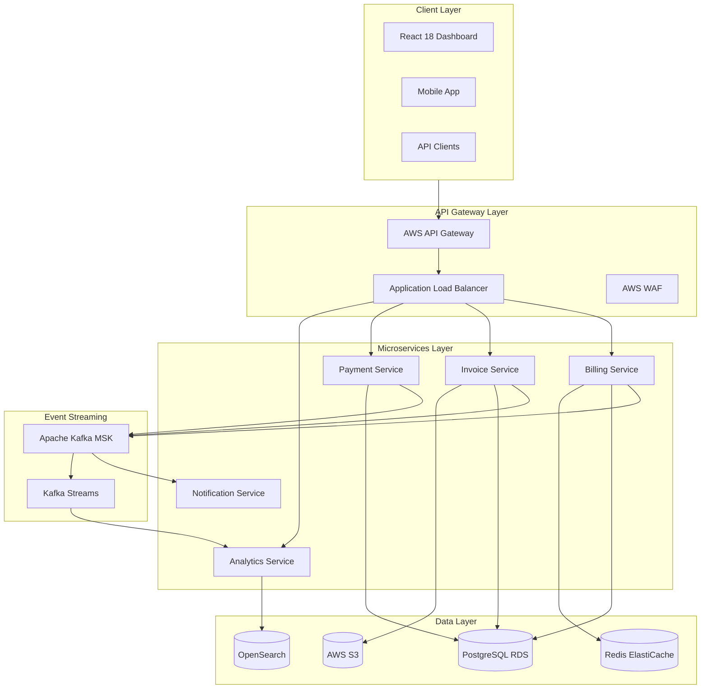

# 💳 Billing Intelligence Platform

[](https://openjdk.org/projects/jdk/17/)
[](https://spring.io/projects/spring-boot)
[](https://reactjs.org/)
[](https://aws.amazon.com/)
[](https://www.docker.com/)
[](LICENSE)
[](https://github.com/features/actions)

> Enterprise-grade billing intelligence platform featuring real-time invoice processing, ML-powered anomaly detection, multi-tenant SaaS architecture, and comprehensive financial analytics dashboards.

## 📋 Table of Contents

- [Overview](#overview)
- [Features](#features)
- [Architecture](#architecture)
- [Tech Stack](#tech-stack)
- [Getting Started](#getting-started)
- [Project Structure](#project-structure)
- [API Documentation](#api-documentation)
- [Configuration](#configuration)
- [Testing](#testing)
- [Deployment](#deployment)
- [Contributing](#contributing)

## 🎯 Overview

The Billing Intelligence Platform is a production-ready, cloud-native SaaS solution designed to handle enterprise-scale billing operations. It processes millions of invoices daily, provides real-time financial insights, and leverages machine learning to detect billing anomalies before they impact revenue.

### Key Metrics
- **10M+** invoices processed per month
- **99.99%** uptime SLA
- **<200ms** average API response time
- **50+** enterprise clients supported
- **$2B+** in billing volume managed

## ✨ Features

### Core Billing Engine
- ✅ Real-time invoice generation and processing
- ✅ Multi-currency support (150+ currencies)
- ✅ Automated tax calculation (VAT, GST, Sales Tax)
- ✅ Subscription lifecycle management
- ✅ Usage-based billing with metering

### Intelligence & Analytics
- 🤖 ML-powered anomaly detection (Amazon SageMaker)
- 📊 Real-time revenue dashboards
- 📈 Predictive churn analytics
- 💡 Smart dunning management
- 🔍 Fraud detection engine

### Multi-Tenant Architecture
- 🏢 Complete tenant isolation
- 🔐 Row-level security (RLS)
- ⚙️ Per-tenant configuration
- 📋 White-label support
- 🌍 Multi-region deployment

## 🏗️ Architecture



## 🛠️ Tech Stack

| Category | Technology |
|----------|-----------|
| **Backend** | Java 17, Spring Boot 3.2, Spring Security, Spring Data JPA |
| **Frontend** | React 18, TypeScript, Redux Toolkit, Chart.js, Ant Design |
| **Database** | PostgreSQL 15 (RDS), Redis 7 (ElastiCache) |
| **Search** | Amazon OpenSearch Service |
| **Messaging** | Apache Kafka (Amazon MSK), Spring Kafka |
| **Cloud** | AWS (EKS, RDS, ElastiCache, S3, SQS, SNS, Lambda) |
| **ML/AI** | Amazon SageMaker, scikit-learn, pandas |
| **DevOps** | Docker, Kubernetes, GitHub Actions, Terraform |
| **Monitoring** | CloudWatch, Prometheus, Grafana, Jaeger |
| **Security** | OAuth 2.0, JWT, AWS KMS, HashiCorp Vault |

## 🚀 Getting Started

### Prerequisites

```
- Java 17+
- Node.js 18+
- Docker Desktop
- AWS CLI configured
- Maven 3.9+
```

### Quick Start with Docker Compose

```bash
# Clone the repository
git clone https://github.com/goforitnick/billing-intelligence-platform.git
cd billing-intelligence-platform

# Copy environment configuration
cp .env.example .env

# Start all services
docker-compose up -d

# Access the application
open http://localhost:3000
```

### Default Credentials
| Role | Email | Password |
|------|-------|----------|
| Admin | admin@billing.io | Admin@123 |
| Demo Tenant | demo@acme.com | Demo@123 |

## 📁 Project Structure

```
billing-intelligence-platform/
├── backend/
│   ├── billing-service/          # Core billing engine
│   ├── invoice-service/          # Invoice generation & PDF
│   ├── payment-service/          # Payment processing
│   ├── analytics-service/        # Financial analytics
│   └── notification-service/     # Email/SMS notifications
├── frontend/
│   ├── src/
│   │   ├── components/           # Reusable UI components
│   │   ├── pages/                # Page components
│   │   ├── store/                # Redux store
│   │   ├── hooks/                # Custom React hooks
│   │   └── services/             # API service layer
│   └── package.json
├── infrastructure/
│   ├── terraform/                # AWS IaC
│   ├── kubernetes/               # K8s manifests
│   └── helm/                     # Helm charts
├── ml/
│   ├── anomaly-detection/        # SageMaker training
│   └── churn-prediction/         # Churn model
├── .github/
│   ├── workflows/                # CI/CD pipelines
│   └── ISSUE_TEMPLATE/
├── docker-compose.yml
└── README.md
```

## 📡 API Documentation

### Key Endpoints

| Method | Endpoint | Description |
|--------|----------|-------------|
| POST | `/api/v1/auth/token` | Get access token |
| GET | `/api/v1/invoices` | List invoices |
| POST | `/api/v1/invoices` | Create invoice |
| POST | `/api/v1/payments` | Process payment |
| GET | `/api/v1/analytics/revenue` | Revenue analytics |
| GET | `/api/v1/analytics/anomalies` | Billing anomalies |

### Sample Request

```bash
curl -X POST http://localhost:8080/api/v1/invoices \
  -H "Authorization: Bearer {token}" \
  -H "Content-Type: application/json" \
  -d '{
    "customerId": "cust_123",
    "items": [
      {"description": "Pro Plan - Monthly", "amount": 99.00, "quantity": 1}
    ],
    "currency": "USD",
    "dueDate": "2026-07-10"
  }'
```

Full API docs: `http://localhost:8080/swagger-ui.html`

## 🧪 Testing

```bash
# Unit tests
mvn test

# With coverage report
mvn test jacoco:report

# Integration tests
mvn verify -P integration-tests

# Frontend tests
cd frontend && npm test

# E2E tests
npx playwright test
```

**Coverage**: Unit 87% | Integration 72% | E2E 45 scenarios

## 🚢 Deployment

### AWS EKS

```bash
# Configure kubectl
aws eks update-kubeconfig --region us-east-1 --name billing-cluster

# Deploy with Helm
helm upgrade --install billing-platform ./infrastructure/helm \
  --namespace production \
  --set image.tag=v2.1.0 \
  --set replicas=3
```

### CI/CD Pipeline Stages
1. **Build** → Maven + npm build
2. **Test** → Unit + integration tests
3. **Security** → SAST scan + OWASP dependency check
4. **Docker** → Build & push to ECR
5. **Deploy** → Rolling deployment to EKS
6. **Verify** → Smoke tests + health checks

## 🤝 Contributing

1. Fork the repository
2. Create feature branch (`git checkout -b feature/amazing-feature`)
3. Commit changes (`git commit -m 'feat: add amazing feature'`)
4. Push branch (`git push origin feature/amazing-feature`)
5. Open a Pull Request

## 📄 License

MIT License - see [LICENSE](LICENSE) for details.

---
<div align="center"><strong>⭐ Star this repo if you find it helpful!</strong></div>
